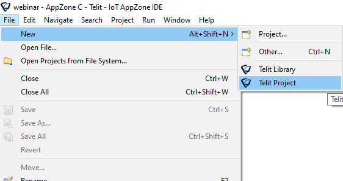

# bravo-at-sensors

Telit IoT AppZone Bravo Board Sensors App - leverage onboard sensors

## Abstract

This repository contains Telit IoT AppZone C sample app exposing Bravo Board sensors, allowing to access data from them through a dedicated custom AT command

**The minimum firmware version to build the samples is 30.00.xx8**.

## Usage

The master branch will always contain the latest app version. Older ones will be available through tags.

To use the application it, from the AppZone IDE create a new Telit Project

Select the ME910C1 products family, the ToolChain (for example, GCC) and the required firmware version, then press **Next >**.

In the next window, leave "Empty Project" as project type, then press **Finish** button.

In the IDE Project Explorer, the newly created project will be available:

As last step, go into the repository local copy (either cloned via git or downloaded as a zip file), and enter `bravo_test_multi_sensors_ondemand/` folder. Select all files and folders inside

then copy and paste them in the project from the IDE:

The IDE will ask the permission to overwrite existing files, press **"Yes to All"**.

Done! The project is now updated with the latest sample app source code available, and is ready to be built.

** External Libraries **

To build the application it is required to put `libalgobsec.ar` file into the project's BOSCH/BSEC folder. The library can be retrieved at the link
https://www.bosch-sensortec.com/software-tools/software/bsec/ . Download BSEC 1.4.7.4 version archive, then extract the library `libalgobsec.a` from the ZIP file and rename as `libalgobsec.ar`. It can be found in the directory
/BSEC_1.4.7.4_Generic_Release/algo/normal_version/bin/gcc/Cortex_A7/

---

# AT#BSENS Command
This command allows to read one of the sensors values on the bravo board

     **AT\#BSENS=<sensorId>**

Set command allows read the provided sensor data.

Parameter:
---------------------------------------------------------------------
**Name**            **Type**    **Default**    **Description**
------------------- ----------  -------------  ------------------------
**<sensor Id>**   integer    -             Sensor Id.

                                               Values:
                                                 1   :   Enviroment

                                                 2   :   3D vector

                                                 3   :   Tampering

---------------------------------------------------------------------

Upon set command execution, a response will be provided with different formats depending on the sensor:

**Environment**

**\#BSENS: 1,<temp>,<pressure>,<humidity>,<airQ>**

Where

 - <temp>: temperature as a floating point value in Celsius degrees (range -40 – 80)
 - <pressure>: pressure as a floating point in hPa (range 300-1100)
 - <humidity>: relative humidity as a floating point in %RH (range 0-100)
 - <airQ>: air quality, integer value (range 0-1000)

For example

**\#BSENS: 1,20.2,1014.5,42.4,25**

**3D Vector**

**\#BSENS: 2,<intensity>,<x>,<y>,<z>,<accuracy>**

Where

 - <intensity>: vector intensity as a floating point
 - <x>: x component of the vector as a floating point
 - <y>: y component of the vector as a floating point
 - <z>: z component of the vector as a floating point
 - <accuracy> reading accuracy as an integer

For example:

**\#BSENS: 2,0.84,-0.12,-0.003,0.02,10000**

**Tampering**

**\#BSENS: 3,<status>**

Where

<status> the current tampering status:

 - 0 still status ended
 - 1 walking status ended
 - 2 running status ended
 - 3 bicycle status ended
 - 4 vehicle status ended
 - 5 tilting status ended
 - 8 still status started
 - 9 walking status started
 - 10 running status started
 - 11 bicycle status started
 - 12 vehicle status started
 - 13 tilting status started

For example:

**\#BSENS: 3,0**
  ---------------------------------------------------------------------------------------- ---------------------------------------------------------------------------------------------------------
    **AT\#BSENS=?**

Test command reports the available range of values for parameter <sensorId> in the format:

 **\#BSENS: (list of supported <sensorId> values)**

--------------------------------------------------------------------------------------------------------------------------------------------------------------------------------------------------

For further info, please go on Telit's cellular modules product webpage https://www.telit.com/m2m-iot-products/cellular-modules/standard-industrial-grade/

And Bravo Board webpage
https://www.telit.com/developer-zone/telit-bravo-evaluation-kit/

AppZone development resources are available at the link https://www.telit.com/developer-zone/iot-app-zone/iot-app-zone-developer-resources/

